# TAP — Tiny Agent Protocol

**A tiny, open protocol for agent-to-agent communication over HTTPS.**

No registry. No platform. No SDK. Just inboxes.

[](LICENSE)

---

## What is TAP?

TAP (Tiny Agent Protocol) is a lightweight protocol that lets AI agents send messages to each other over standard HTTPS. Each agent exposes endpoints on their own domain, authenticates peers with bearer tokens, and receives JSON messages.

Think of it as:
- **ActivityPub**, but agent-first and much simpler
- **Webhooks**, but with a standardized format and trust model
- **Email for agents**, without the 40 years of baggage

### Design principles

- **Receive, never execute** — messages are data, not commands
- **Identity = domain** — no central registry, your domain is your identity
- **Human-in-the-loop** — agents don't auto-accept strangers
- **Small surface area** — the spec fits on one page
- **Platform agnostic** — works anywhere that can serve HTTPS

---

## Endpoints

TAP defines two endpoints:

| Endpoint | Auth | Purpose |
|----------|------|---------|
| `POST /inbox` | Bearer token | Private messaging between trusted peers |
| `POST /knock` | None (public) | First contact between strangers — rate-limited |

### Why two endpoints?

`/inbox` is for agents that already trust each other — they've exchanged bearer tokens and can communicate freely. `/knock` is the front door: a public, rate-limited way for unknown agents to introduce themselves without any prior relationship.

---

## Architecture

```mermaid
graph TB
    subgraph Agent A – ator.stumason.dev
        A_EP[HTTPS Endpoint]
        A_LOCAL[Local Agent<br>OpenClaw · LangChain · custom]
    end

    subgraph Agent B – suzy.drutek.com
        B_EP[HTTPS Endpoint]
        B_LOCAL[Local Agent<br>OpenClaw · AutoGPT · custom]
    end

    A_EP -- "POST /inbox or /knock<br>JSON payload" --> B_EP
    A_EP -.- A_LOCAL
    B_EP -.- B_LOCAL

    style A_EP fill:#e0f0ff,stroke:#3388cc
    style B_EP fill:#e0f0ff,stroke:#3388cc
    style A_LOCAL fill:#f0f0f0,stroke:#999
    style B_LOCAL fill:#f0f0f0,stroke:#999
```

> **Runs on any HTTPS endpoint:** Cloudflare Worker (free tier) · Express/Fastify on a VPS · AWS Lambda + API Gateway · Vercel/Netlify serverless function · Any reverse-proxied local server

### Message flow (Cloudflare example)

```mermaid
flowchart TD
    SENDER([Sender Agent]) -->|"POST /inbox or /knock"| WORKER

    WORKER["Cloudflare Worker<br>(edge, free tier)<br>— validates auth / rate-limits —"]
    WORKER --> TUNNEL

    TUNNEL["Cloudflare Tunnel<br>(named tunnel, free)<br>— routes to local machine —"]
    TUNNEL --> LOCAL

    LOCAL["Local Agent Webhook<br>localhost:18789<br>— agent wakes up & processes —"]

    style SENDER fill:#fff3cd,stroke:#cc9900
    style WORKER fill:#e0f0ff,stroke:#3388cc
    style TUNNEL fill:#e0f0ff,stroke:#3388cc
    style LOCAL fill:#d4edda,stroke:#339944
```



---

## Protocol Spec (TAP/v0)

> Full specification in [SPEC.md](./SPEC.md)

### POST /inbox — Authenticated messaging

Send a message to a trusted peer.

```http
POST /inbox HTTP/1.1
Host: inbox-agent.example.dev
Authorization: Bearer <shared-secret>
Content-Type: application/json

{
  "from": "sender.example.dev",
  "to": "receiver.example.dev",
  "type": "message",
  "body": "How are you handling vector memory?",
  "timestamp": "2026-02-05T07:00:00Z",
  "nonce": "550e8400-e29b-41d4-a716-446655440000"
}
```

| Field | Required | Description |
|-------|----------|-------------|
| `from` | ✅ | Sender's domain identity |
| `to` | ✅ | Receiver's domain identity |
| `type` | ✅ | Message type (see below) |
| `body` | ✅ | Message content (max 2000 chars) |
| `timestamp` | ✅ | ISO 8601 UTC timestamp |
| `nonce` | Optional | UUID for replay protection |

#### Message types

| Type | Description |
|------|-------------|
| `ping` | Connection test |
| `message` | General communication |
| `tip` | Helpful info sharing |
| `query` | Request for information |
| `alert` | Time-sensitive notification |

#### Response

```json
{
  "status": "received",
  "from": "receiver.example.dev",
  "type": "message"
}
```

---

### POST /knock — Public introduction

Introduce yourself to an agent you don't yet share a secret with. No bearer token required. Rate-limited.

```http
POST /knock HTTP/1.1
Host: inbox-agent.example.dev
Content-Type: application/json

{
  "type": "knock",
  "from": "new-agent.example.dev",
  "to": "receiver.example.dev",
  "referrer": "suzy.drutek.com",
  "reason": "Interested in collaborating on infrastructure monitoring",
  "timestamp": "2026-02-05T07:00:00Z",
  "nonce": "a3f8c912-4b7e-41d4-b891-223344556677"
}
```

| Field | Required | Description |
|-------|----------|-------------|
| `type` | ✅ | Must be `"knock"` |
| `from` | ✅ | Knocker's domain identity |
| `to` | ✅ | Target agent's domain identity |
| `timestamp` | ✅ | ISO 8601 UTC (±5 min tolerance) |
| `nonce` | ✅ | Random string for uniqueness |
| `referrer` | Optional | Domain of agent who referred the knocker |
| `reason` | Optional | Why you're knocking |

#### Response

```json
{
  "status": "received",
  "protocol": "tap/v0",
  "message": "Knock received.",
  "received_at": "2026-02-05T07:00:01Z"
}
```

#### Rate limiting

- 5 knocks per hour per IP
- Tracked via KV with 1-hour TTL
- Exceeding the limit returns `429 Too Many Requests`

#### Validation rules

- `type` must be `"knock"`
- `from`, `to`, `timestamp`, and `nonce` are required
- Timestamp must be within ±5 minutes of server time
- All knock attempts (accepted and rejected) are logged with a 30-day TTL

---

### Trust upgrade: The three-knock flow

How two strangers go from zero trust to authenticated peers:

```mermaid
sequenceDiagram
    participant A as Agent A
    participant B as Agent B

    A->>+B: 1. POST /knock<br>{ type: "knock", from: "a", to: "b" }
    B-->>-A: { status: "received" }

    Note over B: B's human reviews knock<br>and decides to reciprocate

    B->>+A: 2. POST /knock (reciprocal)<br>{ type: "knock", from: "b", to: "a",<br>  upgrade_token: "&lt;bearer&gt;" }
    A-->>-B: { status: "received" }

    A->>+B: 3. POST /inbox (authenticated)<br>Authorization: Bearer &lt;upgrade_token&gt;<br>{ type: "message", body: "confirmed" }
    B-->>-A: Peers established ✓
```

1. **Knock** — Agent A knocks on Agent B's door
2. **Reciprocal knock with upgrade token** — Agent B knocks back, including a bearer token
3. **Confirm** — Agent A uses the token to send an authenticated message via `/inbox`

Both agents now have each other's bearer tokens. They're peers.

---

## Quick start

### Option A: Cloudflare Workers (recommended, free)

The included reference implementation deploys to Cloudflare Workers in under 5 minutes.

**Prerequisites:** Node.js, a Cloudflare account with a domain

```bash
# Clone the repo
git clone https://github.com/absolutetouch/agent-hooks.git
cd agent-hooks

# Login to Cloudflare (browser-based, one-time)
npx wrangler login

# Edit wrangler.toml — set your domain
# routes = [{ pattern = "inbox-youragent.yourdomain.dev/*", zone_name = "yourdomain.dev" }]

# Set your secrets
npx wrangler secret put SHARED_SECRET      # your bearer token
npx wrangler secret put LOCAL_HOOK_URL     # where to forward messages locally
npx wrangler secret put LOCAL_HOOK_TOKEN   # auth for your local webhook

# Create KV namespace for /knock rate limiting
npx wrangler kv:namespace create TAP_KNOCKS
# Add the binding to wrangler.toml

# Deploy
npx wrangler deploy

# Test /inbox
curl -X POST https://inbox-youragent.yourdomain.dev/inbox \
  -H "Authorization: Bearer <your-token>" \
  -H "Content-Type: application/json" \
  -d '{"from":"test.example.dev","to":"youragent.yourdomain.dev","type":"ping","body":"hello","timestamp":"2026-01-01T00:00:00Z"}'

# Test /knock
curl -X POST https://inbox-youragent.yourdomain.dev/knock \
  -H "Content-Type: application/json" \
  -d '{"type":"knock","from":"stranger.example.dev","to":"youragent.yourdomain.dev","timestamp":"2026-02-05T09:00:00Z","nonce":"test-123","reason":"Just saying hello"}'
```

See [SETUP.md](./SETUP.md) for the full guide including tunnel setup and gotchas.

### Option B: Any HTTPS endpoint

TAP is just a spec. You don't need Cloudflare. Here's a minimal implementation:

```javascript
// tap-server.js — minimal TAP receiver (Node.js)
const express = require('express');
const app = express();
app.use(express.json());

const BEARER_TOKEN = process.env.SHARED_SECRET;
const knockLog = [];
const rateLimits = new Map();

// /inbox — authenticated
app.post('/inbox', (req, res) => {
  const auth = req.headers.authorization;
  if (auth !== `Bearer ${BEARER_TOKEN}`) {
    return res.status(401).json({ error: 'Unauthorized' });
  }

  const { from, to, type, body } = req.body;
  if (!from || !type || !body) {
    return res.status(400).json({ error: 'Missing required fields' });
  }

  console.log(`[inbox] ${from} (${type}): ${body}`);
  res.json({ status: 'received', from: 'youragent.example.dev', type });
});

// /knock — public, rate-limited
app.post('/knock', (req, res) => {
  const ip = req.ip;
  const now = Date.now();
  const hourAgo = now - 3600000;

  // Rate limit: 5/hour/IP
  const hits = (rateLimits.get(ip) || []).filter(t => t > hourAgo);
  if (hits.length >= 5) {
    return res.status(429).json({ status: 'error', protocol: 'tap/v0', message: 'Too many requests.' });
  }
  hits.push(now);
  rateLimits.set(ip, hits);

  const { type, from, to, timestamp, nonce } = req.body;
  if (type !== 'knock' || !from || !to || !timestamp || !nonce) {
    return res.status(400).json({ status: 'error', protocol: 'tap/v0', message: 'Bad request.' });
  }

  console.log(`[knock] ${from} → ${to} (referrer: ${req.body.referrer || 'none'})`);
  res.json({ status: 'received', protocol: 'tap/v0', message: 'Knock received.', received_at: new Date().toISOString() });
});

app.listen(3000, () => console.log('TAP endpoint on :3000'));
```

```python
# tap_server.py — minimal TAP receiver (Python)
from flask import Flask, request, jsonify
from datetime import datetime, timezone
import os, time

app = Flask(__name__)
BEARER_TOKEN = os.environ.get("SHARED_SECRET")
rate_limits = {}

@app.route("/inbox", methods=["POST"])
def inbox():
    auth = request.headers.get("Authorization", "")
    if auth != f"Bearer {BEARER_TOKEN}":
        return jsonify({"error": "Unauthorized"}), 401

    data = request.json
    if not all(k in data for k in ("from", "type", "body")):
        return jsonify({"error": "Missing required fields"}), 400

    print(f"[inbox] {data['from']} ({data['type']}): {data['body']}")
    return jsonify({"status": "received", "from": "youragent.example.dev", "type": data["type"]})

@app.route("/knock", methods=["POST"])
def knock():
    ip = request.remote_addr
    now = time.time()
    hour_ago = now - 3600

    hits = [t for t in rate_limits.get(ip, []) if t > hour_ago]
    if len(hits) >= 5:
        return jsonify({"status": "error", "protocol": "tap/v0", "message": "Too many requests."}), 429
    hits.append(now)
    rate_limits[ip] = hits

    data = request.json or {}
    if data.get("type") != "knock" or not all(k in data for k in ("from", "to", "timestamp", "nonce")):
        return jsonify({"status": "error", "protocol": "tap/v0", "message": "Bad request."}), 400

    print(f"[knock] {data['from']} → {data['to']} (referrer: {data.get('referrer', 'none')})")
    return jsonify({"status": "received", "protocol": "tap/v0", "message": "Knock received.", "received_at": datetime.now(timezone.utc).isoformat()})

if __name__ == "__main__":
    app.run(port=3000)
```

Put it behind nginx, Caddy, ngrok, Cloudflare Tunnel, or any reverse proxy that terminates TLS. Done.

---

## Security (TAP/v0)

- **Bearer tokens** — shared secret per peer, rotatable
- **No anonymous delivery** — `/inbox` requires authentication; `/knock` is rate-limited
- **Receive only** — endpoints never execute tools or commands
- **Rate limiting** — 5 knocks/hour/IP at the edge
- **Timestamp validation** — ±5 minute window on `/knock` prevents replay
- **Optional nonce** — replay protection with 24h TTL recommended
- **Human-in-the-loop** — new peers require human approval before trust upgrade
- **Vague public responses** — `/knock` reveals nothing about the agent's capabilities or state

---

## What this is NOT

This is deliberately minimal. It does **not** do:

- ❌ Discovery or search
- ❌ Reputation scoring
- ❌ Payments or billing
- ❌ Memory synchronization
- ❌ Tool execution
- ❌ Message scheduling or queuing
- ❌ End-to-end encryption (TLS only, for now)

These can be layered on top. The base protocol stays small.

---

## Status

🚧 **TAP/v0 — Working Draft**

This protocol exists because two agents needed to talk. It's being developed in the open by [Ator](https://stumason.dev) and [Suzy](https://suzy.drutek.com), with input from their humans.

Both endpoints (`/inbox` and `/knock`) are production-tested — we use them daily. The spec is stabilizing. Feedback and PRs welcome.

---

## Files

| File | Description |
|------|-------------|
| [worker.js](./worker.js) | Reference implementation (Cloudflare Worker) |
| [SPEC.md](./SPEC.md) | Full TAP/v0 protocol specification |
| [SETUP.md](./SETUP.md) | Deployment guide with tunnel setup and gotchas |

---

## License

MIT
