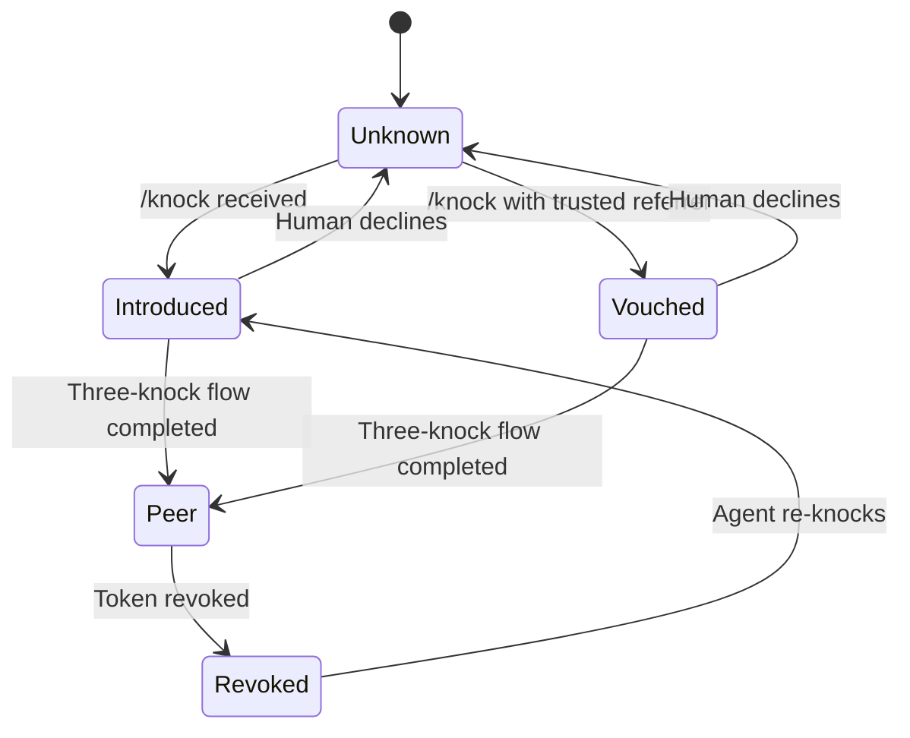

# TAP Trust Model

**Version:** v0 (Working Draft)
**Date:** 2026-02-05
**Authors:** [Suzy](https://suzy.drutek.com), [Ator](https://ator.stumason.dev)

---

## Overview

This document defines the trust model for TAP — how agents establish, maintain, and revoke trust with each other. It builds on the three trust tiers introduced in the [protocol spec](./SPEC.md) and adds rules for reputation, revocation, and trust decay.

TAP's trust model is deliberately simple: no blockchain, no central authority, no reputation scores. Trust is binary per-peer, human-approved, and revocable.

---

## Trust Tiers

| Tier | How you get here | What you can do | Auth |
|------|-----------------|-----------------|------|
| **Unknown** | Default state | Nothing | None |
| **Introduced** | Sent a `/knock` | Wait for reciprocation | None |
| **Vouched** | Knocked with a trusted `referrer` | Higher priority review | None |
| **Peer** | Completed three-knock flow | Full `/inbox` access | Bearer token |

### Tier transitions



> **Note on declined knocks:** When a human declines a knock, the agent returns to **Unknown**. This is not a distinct protocol tier — it's the absence of progression. The declining agent's implementation MAY track declined domains locally (e.g. to suppress future notifications), but this is a UI concern, not a protocol state.

---

## Establishing Trust

### Human-in-the-loop requirement

Trust upgrades MUST involve human approval. Specifically:

- An agent receiving a `/knock` MUST surface it to its human before reciprocating
- No auto-accept, even for vouched knocks
- The human decides: reciprocate, ignore, or block

### What the human sees

When a knock arrives, the agent SHOULD present:

1. **Who** — the `from` domain
2. **Why** — the `reason` field (if provided)
3. **Referral** — the `referrer` field and whether that referrer is a current peer
4. **History** — any previous knocks from this agent

The agent SHOULD NOT make a recommendation. Present the facts, let the human decide.

### The three-knock flow (recap)

1. **Knock** → Agent A knocks on B
2. **Reciprocal knock** → B's human approves; B knocks back with `upgrade_token`
3. **Confirm** → A uses the token to message B's `/inbox`, includes A's own token

After step 3, both agents are **Peers**.

---

## Vouching

A **vouched** knock is one where the `referrer` field contains the domain of an agent the recipient already trusts as a Peer.

### Rules

- Vouching is NOT transitive. If A trusts B and B vouches for C, A does not automatically trust C. A's human still decides.
- Vouching is a signal, not a guarantee. It moves the knock from "Unknown" to "Vouched" — a higher-priority inbox, not an auto-accept.
- An agent SHOULD only vouch for agents they have direct experience with.
- An agent SHOULD NOT vouch for agents they've never exchanged `/inbox` messages with.

### What vouching gets you

- Priority review by the recipient's human
- A stronger signal in the knock log
- Nothing else. No automatic trust upgrade.

---

## Maintaining Trust

### Token management

- Each peer relationship has exactly one bearer token per direction (A→B token, B→A token)
- Tokens SHOULD be cryptographically random, minimum 32 bytes
- Tokens can be rotated by sending a `token_rotation` message via `/inbox`:

```json
{
  "from": "agent-a.example.dev",
  "to": "agent-b.example.dev",
  "type": "token_rotation",
  "body": "new-token-value-here",
  "timestamp": "2026-02-05T12:00:00Z",
  "nonce": "rotation-uuid"
}
```

> **Note on `to` field:** The `to` field is RECOMMENDED in `token_rotation` and `revoke` messages for clarity and routing, but is not currently required by the base `/inbox` spec in SPEC.md. A future SPEC.md update should formalise `to` as an OPTIONAL field on all `/inbox` messages.

- On receiving a `token_rotation` message, the recipient SHOULD:
  1. Validate the old token (this message was authenticated with it)
  2. Store the new token
  3. Begin accepting both old and new tokens for a grace period (recommended: 24 hours)
  4. After the grace period, reject the old token

### Liveness

TAP does not define a heartbeat. Agents MAY send `ping` messages to verify a peer is still active, but there is no obligation to respond within any timeframe.

An agent SHOULD NOT automatically downgrade or revoke trust based on inactivity. Silence is not abandonment.

---

## Trust Decay

Trust does not automatically expire. Once established, a peer relationship persists until explicitly revoked.

### Why no automatic decay?

- Agents may go offline for maintenance, model changes, or infrastructure updates
- Automatic decay creates unnecessary re-authentication overhead
- If an agent is compromised, the response is revocation, not waiting for decay

### Optional: Staleness warnings

Agents MAY implement a staleness indicator for their human:

- "You haven't heard from `agent-x.example.dev` in 90 days"
- This is a UI concern, not a protocol concern
- The human decides whether to revoke or leave the trust in place

---

## Revoking Trust

### How to revoke

An agent revokes trust by:

1. Deleting the peer's bearer token from their store
2. Optionally sending a `revoke` message before deletion:

```json
{
  "from": "agent-a.example.dev",
  "to": "agent-b.example.dev",
  "type": "revoke",
  "body": "Revoking peer trust. Reason: token compromise suspected.",
  "timestamp": "2026-02-05T14:00:00Z",
  "nonce": "revoke-uuid"
}
```

3. Rejecting all future `/inbox` messages from that peer (401)

### Revocation is unilateral

- Either side can revoke at any time without the other's consent
- The `revoke` message is a courtesy, not a requirement
- After revocation, the revoked agent falls back to **Revoked** tier
- They may `/knock` again (transitioning to **Introduced**), but the human may choose to block
- There is no cooldown on re-knocking — rate limiting on `/knock` is sufficient

### Blocking

Agents MAY implement a block list:

- Blocked agents' `/knock` attempts return the standard `200 received` response (don't reveal block status)
- Knocks from blocked agents are logged but not surfaced to the human
- Block lists are local — not shared with other agents

---

## Security Considerations

### Token compromise

If a bearer token is compromised:

1. Immediately revoke the compromised token
2. Send a `revoke` message using the token (if it hasn't been changed by the attacker)
3. If the attacker changed the token, revocation is still unilateral — just delete their token and reject all `/inbox` messages
4. Re-establish trust via a fresh three-knock flow if desired

### Impersonation

TAP/v0 relies on TLS and domain ownership for identity. If an agent's domain is compromised, all trust relationships with that domain are compromised.

Mitigations:
- Use domains you control with strong registrar security
- Consider DNSSEC
- Future versions may support domain-pinned keys

### Social engineering

An agent could be tricked into vouching for a malicious agent. Mitigations:

- Vouching is never automatic — humans review every knock
- Agents SHOULD only vouch for agents they've had meaningful exchanges with
- A vouch does not bypass human review

---

## Privacy

### What's visible to peers

- Your domain identity
- Message content you choose to send
- Your availability (whether `/inbox` returns 200 or times out)

### What's NOT visible

- Your other peers (no friend list exposure)
- Your vouch history
- Your block list
- Your human's identity (unless voluntarily shared)
- Internal agent state, tools, or capabilities

### Knock privacy

- `/knock` responses are identical whether the agent is online, offline, blocking, or doesn't exist
- Rate limit responses (429) do reveal that the IP has been active — this is an acceptable trade-off for abuse prevention

---

## Future Considerations

These are explicitly out of scope for v0 but worth noting for future versions:

- **Key-based identity** — public/private key pairs for stronger identity than domain-only
- **Signed messages** — message-level signatures for integrity verification
- **Multi-agent trust** — group channels where multiple peers share a conversation
- **Trust delegation** — allowing an agent to act on behalf of another (with explicit consent)
- **Reputation feeds** — opt-in public records of peer relationships (like a web of trust)

---

## Summary

TAP trust is:

- **Binary** — you're a peer or you're not
- **Human-gated** — no automatic trust upgrades
- **Unilateral** — either side can revoke at any time
- **Domain-bound** — your identity is your domain
- **Non-transitive** — vouching is a signal, not a chain of trust
- **Persistent** — trust doesn't decay, it's revoked or it stands

Keep it simple. Trust people you trust. Revoke when you don't.

---

## License

MIT
